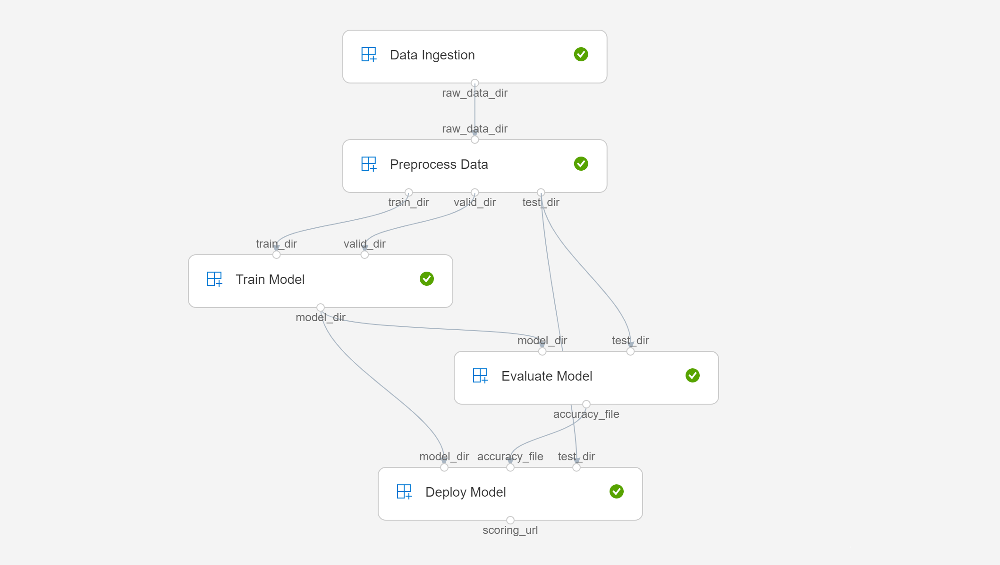

# Azure Machine Learning Pipelines Demo

An [Azure Machine Learning pipeline](https://aka.ms/pl-concept) is an independently executable workflow of a complete machine learning task. Subtasks are encapsulated as a series of steps within the pipeline. Each step is an executable module of code which can have inputs and produce outputs (which can then be consumed by other steps as inputs). 


There are multiple advantages to using pipelines:

- It allows data scientists to separate tasks into non-overlapping components, enabling collaboration and development in parallel.
- It allows teams and organizations to create reusable templates for common tasks.
- It allows more optimal usage of compute resources (e.g., data preparation steps can be run on a CPU, while model training steps run on a GPU).
- If enabled, it allows the cached output of a step to be reused in cases where re-running it would not give a different result (e.g., a step for preprocessing data would not run again if the inputs and source code remains the same - it would just use the same output from the previous run).

The following repository shows an example of how you can use the Azure Machine Learning SDK to create a pipeline. 

## Object Classification Problem

In order to show the example, we will be training a model that is able to classify objects belonging to a list of categories. We will build our own dataset, train a model on it, and deploy the result to a webservice. More specifically, the pipeline will be split into the following steps.

#### Step 1: Data Ingestion

`Input`: Blob datastore reference. 

`Output`: Reference to directory containing the raw data.

This step will leverage [Azure Cognitive Services](https://azure.microsoft.com/en-us/services/cognitive-services/) to search the web for images to create our dataset. This replicates the real-world scenario of data being ingested from a constantly changing source. For this demo, we will use the same 10 classes in the [CIFAR-10 dataset](https://www.cs.toronto.edu/~kriz/cifar.html) (airplane, automobile, bird, cat, deer, dog, frog, horse, ship, truck). All images will be saved into a directory in the input datastore reference.

#### Step 2: Preprocess Data

`Input`: Reference to directory containing the raw data.

`Outputs`: Reference to training data directory, reference to validation data directory, reference to testing data directory.

This step will take the raw data downloaded from the previous step and preprocess it by cropping it to a consistent size, shuffling the data, and splitting it into train, valid, and test directories.

#### Step 3: Train Model

`Inputs`: Reference to training data directory, reference to validation data directory.

`Output`: Reference to the directory that trained model is saved to.

This step will fine-tune a RESNET-18 model on our dataset using PyTorch. It will use the corresponding input image directories as training and validation data.

#### Step 4: Evaluate Model

`Inputs`:  Reference to the directory that trained model was saved to, reference to testing data directory.

`Output`: Reference to a file storing the testing accuracy of the model

This step evaluates the trained model on the testing data and outputs the accuracy.

#### Step 5: Deploy Model

`Inputs`:  Reference to the directory that trained model was saved to, reference to the file storing the testing accuracy of the model, reference to testing data directory.

`Output`: Reference to a file storing the endpoint url for the deployed model.

This step registers and deploys a new model on its first run. In subsequent runs, it will only register and deploy a new model if the training dataset has changed or the dataset did not change, but the accuracy improved.

## Prerequisites

#### Create Azure Machine Learning Workspace

Follow the first part of [this tutorial](https://docs.microsoft.com/en-us/azure/machine-learning/service/tutorial-1st-experiment-sdk-setup#create-a-workspace) to create a workspace resource.

Once your workspace has been created, fill in the `config.json` file with the details of your workspace.

#### Create Cognitive Services API Key

The pipeline script requires an environment variable to be set with your Cognitive Services API key, since we use the service in the data ingestion step. Follow [these steps](https://docs.microsoft.com/en-us/azure/cognitive-services/cognitive-services-apis-create-account?tabs=multiservice%2Cwindows) to create your API Key.

Once you've created an API key, set it to an environment variable named `COGNITIVE_SERVICES_API_KEY`.

```
export COGNITIVE_SERVICES_API_KEY='<YOUR API KEY>'
```

#### Install Azure Machine Learning SDK

Run the following command to install the SDK using pip.

```
pip install azureml-sdk
```

## Run The Pipeline

Run the `object-classification-pipeline.py` script to execute the pipeline.

```
python object-classification-pipeline.py
```

To monitor the run and see the results, go to the **[Azure Machine Learning Studio](https://ml.azure.com/)** > *Select your workspace* -> **Experiments** > **Object-Classification-Demo** > *Latest Run ID*.

*The final pipeline should look something like this.*



Once the pipeline run finishes successfully, you can test the output by running the `test-endpoint.py` script.

Here is a sample of an airplane:

```
python test-endpoint.py --image_url https://compote.slate.com/images/222e0b84-f164-4fb1-90e7-d20bc27acd8c.jpg
```
If you want to use a custom image:

```
python test-endpoint.py --image_url <URL OF IMAGE>
```